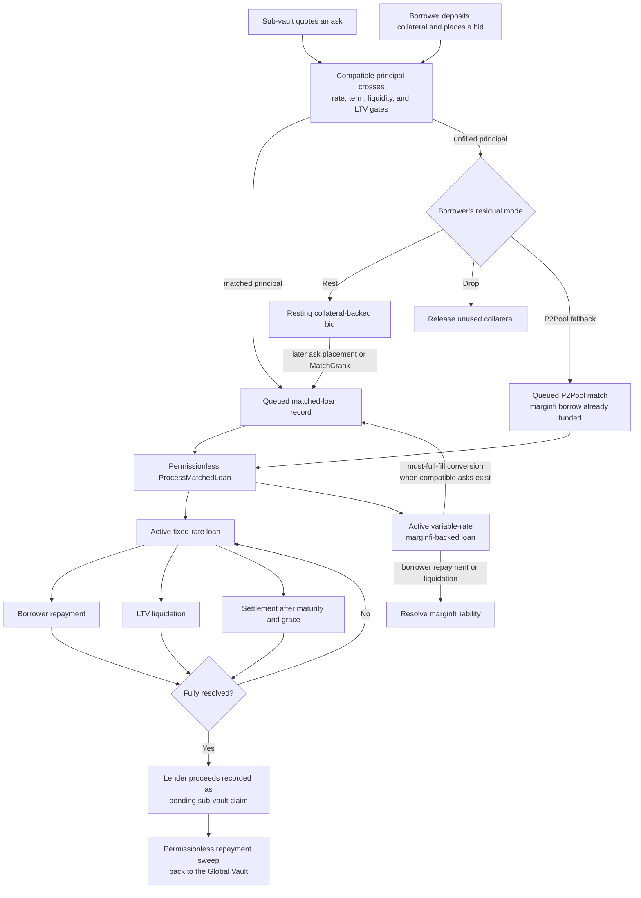
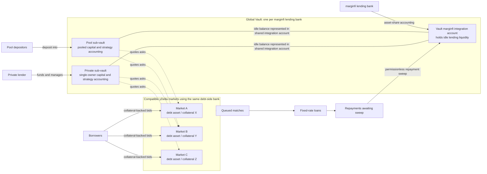

# yDelta

**Fixed-rate credit markets on Solana.**

yDelta connects borrowers seeking fixed-term loans with lending strategies
quoting fixed rates. Borrowers submit collateral-backed bids, lending sub-vaults
quote asks, and compatible orders are matched into individual loans with terms
fixed at origination.

The protocol integrates with marginfi to keep idle vault liquidity and deposited
collateral productive while supporting a variable-rate fallback when fixed-rate
liquidity is unavailable.

## Overview

In pooled lending markets, borrowing and lending rates typically change as pool
utilization changes. yDelta introduces an order book where the cost and duration
of credit are agreed before a fixed loan begins.

The protocol is designed for:

- **Borrowers** who want explicit loan terms and control over how unfilled demand
  is handled.
- **Depositors** who want exposure to curator-managed pooled lending strategies.
- **Private lenders** who want to operate their own lending pool and define their
  own strategy, whether they are sophisticated credit managers or individual
  lenders managing only their own capital.
- **Curators** who configure quote spreads and define the risk policy of a
  lending strategy.
- **Keepers** who process matches, sweep repayments, settle matured loans, and
  liquidate unhealthy positions.

## How It Works

### For Borrowers

Borrowers first claim a market seat (`ClaimSeat`, which also creates their user
account on first call), then deposit collateral and submit a bid containing:

- the principal they want to borrow,
- the loan term,
- the highest lender rate they are willing to match,
- the collateral committed to the request,
- an optional LTV buffer,
- instructions for handling any unfilled principal.

The bid immediately scans compatible asks, beginning with the lowest available
rates. A single bid may be filled by multiple lending strategies.

If fixed-rate liquidity cannot fill the entire request, the borrower chooses one
of three residual modes:

| Mode | Result |
| --- | --- |
| **Fallback** | Borrow the residual through marginfi at a variable rate, subject to marginfi health checks. |
| **Rest** | Leave the residual on the order book as a resting bid. |
| **Drop** | Cancel the residual and release its unused collateral. |

Variable-rate fallback debt can later be converted into fixed-rate loans when
sufficient compatible asks become available.

### For Lenders

Lenders provide liquidity to sub-vaults. Each sub-vault represents a distinct
lending strategy with its own curator, rate spread, LTV limits, liquidation
threshold, and maximum loan term.

Idle sub-vault liquidity is deposited through marginfi. When a queued match is
processed, the required principal is moved from idle liquidity to fund the loan.
When the loan is repaid and claimed, the funds return to the vault and become
available for future matches.

Within a global vault, each sub-vault acts as a basket of one lending asset that
can be quoted across multiple markets with different collateral assets. Its
capital is not permanently divided between those markets: each match draws from
the sub-vault's live available balance. This lets the same lending strategy serve
several credit markets without maintaining a separate liquidity pool for each
one.

Sub-vaults can be:

- **Pool sub-vaults**, which accept deposits from multiple users and are managed
  by a curator.
- **Private sub-vaults**, which are controlled and funded by a single owner. A
  private lender can use one to run a sophisticated credit strategy or simply
  maintain a personal lending pool with their preferred terms.

### For Curators

Curators define a sub-vault's lending policy and quote its liquidity into
eligible markets.

A sub-vault ask is quoted as a spread over the current marginfi lending APR:

```text
ask_rate = current_marginfi_lending_apr + sub_vault_spread
```

Asks are standing quotes rather than fixed-size allocations. Their available
size is calculated when a match occurs from the sub-vault's current idle
liquidity. This allows one basket of lending capital to quote across multiple
collateral markets without pre-allocating capital to each order book.

Curators can refresh asks as the underlying lending APR changes. The matching
engine skips stale asks whose stored rate is below the current marginfi lending
APR.

A sub-vault holds at most one resting ask per market. A spread change reaches
the book only through that refresh, and a curator who wants several price points
in one market runs several sub-vaults rather than laddering quotes.

## Matching And Loan Pricing

A bid and ask can match when:

- the ask rate is within the bid's matching threshold,
- the requested term is within the sub-vault's maximum term,
- the borrower's collateral satisfies the sub-vault's LTV policy.

For a successful fixed-rate match:

```text
lender_rate   = ask_rate
borrower_rate = max(bid_rate, ask_rate + protocol_fee_floor)
```

The borrower's bid rate determines which asks are eligible to match. The final
borrower rate also includes the protocol's configured minimum spread over the
lender rate.

Each resulting fixed loan records:

- principal and collateral,
- borrower and lender rates,
- start and maturity timestamps,
- origination and liquidation LTV thresholds,
- the curator-fee snapshot and fee-accrual balances.

A market may charge an origination fee on matched principal. It is taken out of
the lending sub-vault's deployed capital rather than added to the borrower's
debt: the sub-vault deploys the gross principal, while the loan opens with both
its outstanding debt and its lender claim set to principal minus the fee. The
borrower receives, and owes, that net figure. The queued match carries the fee
amount; at promotion it is added to the market's accumulated protocol fees,
which the protocol admin claims.

The recorded rates and LTV thresholds are fixed for the life of the loan. Later
curator policy changes do not change them for existing loans.

## Risk Management

### Origination

Every sub-vault defines a maximum LTV for new fixed-rate loans. Borrowers can
request a stricter origination limit by providing an LTV buffer:

```text
effective_max_ltv = sub_vault_max_ltv - borrower_ltv_buffer
```

The buffer does not reduce the requested principal automatically. Instead, asks
that cannot satisfy the stricter requirement are skipped, and any unfilled
principal follows the borrower's selected residual mode.

### Liquidation

Fixed-rate loans use the liquidation threshold recorded when the loan was
matched. P2Pool fallback loans use marginfi health rules because their debt is a
marginfi liability.

When a loan becomes unhealthy, a liquidator can repay some or all of its debt in
exchange for collateral, including the configured keeper bonus. Full
liquidations return any remaining collateral to the borrower. A partial
liquidation must retire at least 1% of the outstanding debt, or 1,000 atoms
if that is larger; below 1,000 atoms outstanding, only a full repay is
accepted.

### Maturity Settlement

After a loan's maturity and grace period, a keeper can repay some or all of the
remaining debt and receive the same fraction of the loan's collateral, subject
to the same floor on a partial repay.

Settlement differs from liquidation in two ways: it pays no keeper bonus, and it
returns no surplus. A settlement that closes the loan transfers all remaining
collateral to the keeper, however over-collateralized the loan was.

Borrowers may repay fixed-rate and P2Pool loans before maturity without a
prepayment penalty.

## Loan Lifecycle



One bid can produce multiple fixed loans and a residual outcome. Fixed-rate
matching and loan funding are separate steps: each successful cross first
creates a queued matched-loan record, then a permissionless processor promotes
it into an active loan. For ordinary order-book matches, processing also
completes funding. Two paths queue matches that are already funded and so need
only the promotion step: a P2Pool fallback, which opened its marginfi borrow
during order placement, and a P2Pool conversion, where the conversion
instruction has already used sub-vault liquidity to repay the marginfi
liability.

Repayment, liquidation, and maturity settlement may resolve only part of a
fixed loan. On full resolution, the sub-vault's economic accounting is
reconciled and lender proceeds become pending claims. A later permissionless
sweep moves those proceeds from the market's lender integration account back
into the Global Vault's integration account.

## Protocol Architecture

### Global Vault And Market Relationships



The global vault provides the bank-level marginfi integration and hosts the
sub-vault records. Each sub-vault remains independently funded and accounted:
capital belonging to one sub-vault is not available to another. A sub-vault can
quote into multiple compatible markets, and each successful match draws from
that sub-vault's live available balance.

### Markets

Each market represents one debt asset and one collateral asset. A market stores
the order book, participant seats, queued matches, fee configuration, and its
integration accounts.

### Global Vaults

A global vault is associated with a marginfi bank and hosts multiple sub-vault
strategies for that bank's lending asset. Each sub-vault is independently funded
and can deploy its capital across any compatible yDelta market. It maintains its
own depositor shares, strategy policy, deployed principal, pending claims, and
fee accounting.

### Seats

Markets use seats to track participant balances and open-position counts.
Balances are recorded as withdrawable or encumbered shares. User accounts provide
an index of a wallet's market positions, vault positions, orders, and loans.

A wallet must claim its seat with `ClaimSeat` before it can deposit, withdraw, or
place a bid in that market; the seat-taking instructions reject an unseated
wallet. Sub-vault ask placement is the exception and creates its own seat.

### Loans

The protocol supports two loan types:

| Type | Description |
| --- | --- |
| **Fixed** | An order-book-matched loan with a fixed rate and term. |
| **P2Pool** | A variable-rate marginfi-backed loan created from unfilled borrower demand. |

## Permissionless Operations

The following maintenance operations can be performed by keepers:

| Operation | Purpose |
| --- | --- |
| `MatchCrank` | Match resting bids against compatible resting asks. |
| `ProcessMatchedLoan` | Promote a queued match into a loan account. |
| `ClaimRepaymentForSubVault` | Return lender repayments from a market to its vault. |
| `SettleMaturedLoan` | Resolve debt after maturity and grace. |
| `LiquidateLoan` | Resolve debt after an LTV breach. |
| `CheckLtvLiquidatable` | Simulate the LTV liquidation eligibility check. |
| `CheckMaturityLiquidatable` | Simulate the maturity settlement eligibility check. |

## Program Information

| Item | Value |
| --- | --- |
| Program ID | `HfYCWUgFuUbuzZTeQAAGzVkXw2uFM51QRoDfhFV8vyCj` |
| On-chain program | [`programs/ydelta`](programs/ydelta) |
| TypeScript SDK | [`ts`](ts) |
| Protocol design | [`docs/protocol-design.md`](docs/protocol-design.md) |
| Deployment runbook | [`docs/deployment-runbook.md`](docs/deployment-runbook.md) |

The first byte of each instruction selects a variant from
[`YdeltaInstruction`](programs/ydelta/src/program/instruction.rs). The current
program surface includes market and vault administration, deposits and
withdrawals, borrower and curator order management, loan processing, repayment,
liquidation, settlement, and fee claims.

## TypeScript SDK

The TypeScript SDK provides:

- account decoders,
- PDA helpers,
- instruction builders,
- LTV and share-conversion helpers,
- oracle helpers,
- operator scripts.

See [`ts/README.md`](ts/README.md) for usage and examples.

## Build And Test

Prerequisites:

- Rust `1.86.0`,
- Solana/Agave tooling with `cargo build-sbf`,
- Yarn `4.14.1`.

```bash
# Run the native Rust test suite
./scripts/test.sh

# Run tests against the SBPF program
./scripts/test.sh --sbf

# Build target/deploy/ydelta.so
./scripts/build-program.sh

# Run TypeScript SDK checks
yarn test
yarn typecheck
yarn lint
```

## Repository Layout

```text
.
|-- programs/
|   |-- ydelta/                 # on-chain program
|   |-- ydelta-test-harness/    # test-only CPI harness
|   `-- marginfi-mocks/         # vendored marginfi v0.1.8 CPI types (production dep)
|-- lib/                        # shared hypertree implementation
|-- ts/
|   |-- src/                    # TypeScript SDK
|   |-- scripts/                # operator scripts
|   `-- tests/                  # SDK and integration tests
|-- docs/
|   |-- protocol-design.md
|   `-- deployment-runbook.md
`-- scripts/                    # build, test, deploy, and verification scripts
```
