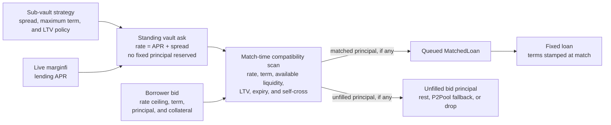
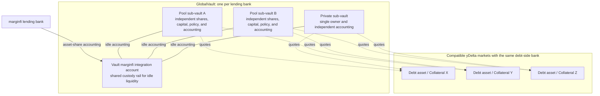
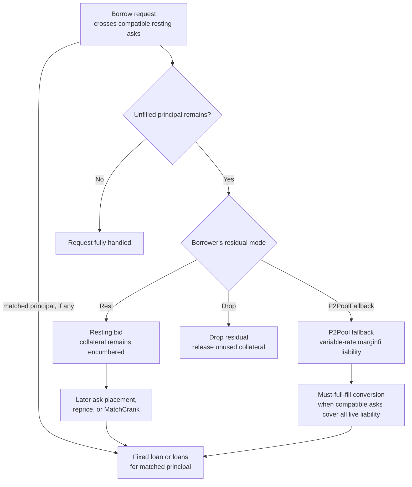
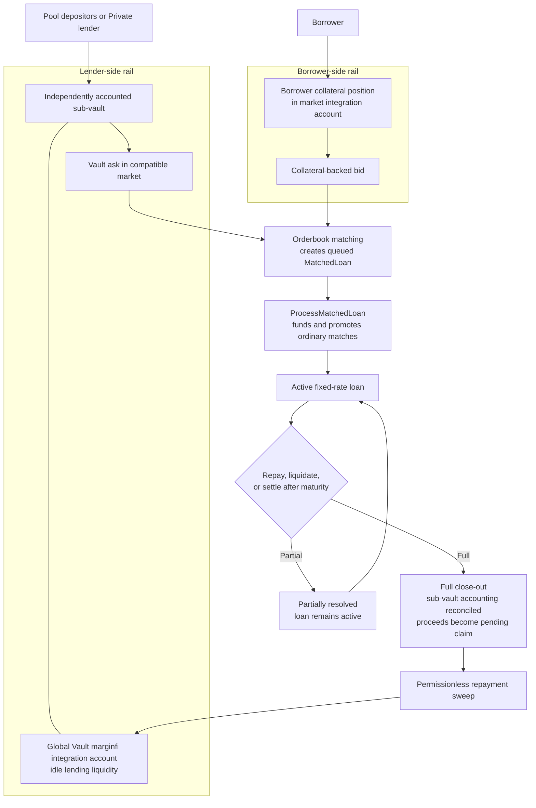
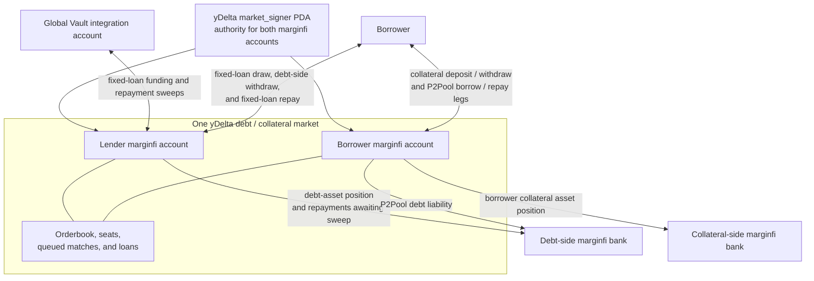

# yDelta Protocol Design

yDelta runs a **two-sided** fixed-rate orderbook. The ask side holds
lender quotes, and those quotes come only from vault **sub-vaults** —
curator-run (Pool) or owner-run (Private). The bid side holds borrower
orders: a borrow request crosses resting asks immediately, and any
unfilled remainder can fall through to a variable-rate backstop, rest on
the book as a standing bid, or drop. Resting bids are crossed by later
ask placements and by a permissionless crank.

## Summary

yDelta is a fixed-rate, fixed-term lending protocol on Solana that prices
credit through a two-sided orderbook.

Borrowers post collateral-backed bids. Lender asks come from independently
funded sub-vaults, which may be pooled curator-managed strategies or private
single-owner lending pools. Each sub-vault can quote its available lending asset
across multiple compatible collateral markets without dividing that capital into
separate per-market pools.

Unfilled borrower demand can rest, drop, or use a variable-rate marginfi-backed
fallback. The protocol also routes idle lending liquidity and borrower collateral
through marginfi integration accounts so those balances are represented as
yield-bearing shares while held by the protocol.

This document describes the protocol model, accounting, matching rules, and
implementation structure.

---

## Design Overview

**Protocol-held lending liquidity and collateral use marginfi shares.**
Idle sub-vault liquidity, borrower collateral, and lender repayments awaiting a
claim are held through marginfi integration accounts. SPL token accounts are
used as transient staging accounts during CPIs. This allows share-value changes
to be reflected in yDelta's accounting while balances remain under protocol
control.

**The variable-rate fallback is optional and convertible.** Borrow intent that
exceeds available fixed-rate liquidity can fall through to a marginfi-backed
P2Pool loan when the borrower selects that residual mode and marginfi health
checks pass. The borrower may later attempt to convert the full live P2Pool
liability into fixed loans when sufficient compatible asks are available.

**Each sub-vault is an independently funded lending strategy.** A single
`GlobalVault` per marginfi **bank** hosts multiple **sub-vaults**, each with its
own capital, operator, spread, LTV ceiling, liquidation threshold, term cap, and
accounting. Sub-vaults come in two kinds: **Pool**
(protocol-admin-created, curator-run, pooled deposits) and **Private**
(permissionlessly created, single-owner, with the owner as curator). A
sub-vault can quote its basket of one lending asset across any compatible market
whose debt side uses the same bank.

**The book is two-sided, but asks are vault-only.** Ask-side quotes come
only from vault sub-vaults — there are no wallet makers and no
market-direct asks. Borrowers post bids: an immediate-or-cancel bid
crosses resting sub-vault asks in one transaction, and its unfilled
residual chooses one of three fates — fall through to the variable-rate
backstop, rest on the bid side of the book, or drop. A resting bid is
later crossed by a fresh or repriced sub-vault ask (which *takes* on
placement) or by anyone running the permissionless **match crank**.
Self-trading is blocked at the **owner** level: a wallet's bid never
fills against a sub-vault that same wallet curates — that pair is skipped,
not aborted, so the scan walks on to a real counterparty.

**Rates are quoted as a spread over the live bank rate.** A sub-vault
does not post an absolute rate. It stores a `spread_bps`, and at
placement the program reads the debt bank's live marginfi lending APR and
stores `lending_APR + spread` in the order. Repricing a market is a
parameterless re-sync. A fill-time floor enforces the same idea on the
way out: the matching engine skips any resting ask whose stored rate has
fallen below the *current* bank lending APR, so a stale quote never fills
below market.

**Fixed loans do not auto-reprice.** A fixed loan opens at its recorded rate and
may be repaid before maturity. If debt remains after maturity and the configured
grace period, it becomes eligible for keeper settlement. Fixed-rate accrual
continues at the recorded rates until the loan is resolved; maturity does not
stop interest accrual.

**Vault asks do not reserve a fixed principal amount.** Ask placement records a
standing quote. Actual capacity is read from the sub-vault at match time, and
fixed-loan atom movement is deferred until `ProcessMatchedLoan`. Order
instructions primarily mutate yDelta accounts, although account expansion can
require a system-program transfer and P2Pool fallback performs marginfi CPIs
inline.

---

## 1. Market model

At the highest level, yDelta matches:

- **lender supply:** sub-vault asks — fixed rate (bank APR + spread),
  fixed term (the sub-vault's `max_term_seconds`), unbounded size
- **borrower demand:** a bid — fixed rate ceiling, term, principal,
  collateral — that fills immediately and optionally rests its residual

The match creates a discrete loan rather than adding both sides to a
pooled balance sheet.



Both sides can rest, but they are not symmetric. Asks are **standing
quotes** owned by vault capital; bids are **transient** borrower orders
with attached collateral. A borrow request first crosses the asks tree in
the same transaction; only the leftover, if the borrower chose to rest
it, becomes a resting bid. The borrower is not simply choosing "how much
to borrow from a pool" — they are choosing the exact credit shape they
are willing to enter, and either fill it now, leave it resting at their
limit, or route it to the fallback.

A book can sit **crossed at rest** — a resting bid whose rate would cross
a resting ask — and that is legal. Crossability changes without order
flow: a vault deposit replenishes a sub-vault's idle capital, a repayment
frees capacity, an oracle move flips an LTV gate. The invariant is not
"the book is never crossed" but "a taking instruction never walks past a
cross it can fill": within the orders it scans and the fill budget it is
given, every pair the engine skips fails at least one gate (rate, term,
sub-vault idle, LTV, floor, expiry, or self-cross).

Two bounds scope that sweep. A bid placement or an ask placement/re-sync
takes only for the order being placed, so a cross between two other
resting orders is left untouched. `MatchCrank` takes a caller-supplied
`max_fills` budget and stops once it is spent, so resolving a deeply
crossed book can take several cranks.

---

## 2. Rate matching and the LTV gate

Every ask belongs to a sub-vault, and the sub-vault carries the policy
the engine reads live at match time: the `max_ltv_bps` origination
ceiling, the `liquidation_ltv_bps` trigger, and `curator_fee_bps`.
Reading these live means a curator's change to them takes effect on the
next fill, with no per-seat re-sync.

Two parameters are instead snapshotted onto the resting ask at placement.
`spread_bps` is baked into the stored rate, and `max_term_seconds` is
stored as the order's `term_seconds`. A lowered `max_term_seconds` bites
immediately only on the bid-taking path, which re-reads the live cap and
skips any ask whose stored term now exceeds it. The `MatchCrank` ask-take
and the P2Pool refinance scan gate on the ask's stored `term_seconds`
alone, so on those paths, as for raising the cap or changing
`spread_bps`, the change reaches the book only when the curator re-places
the ask: the parameterless `UpdateOrderForSubVault` re-sync, or a cancel
followed by a fresh placement.

A borrower's bid crosses an ask when the rate and term are compatible:

```text
ask_rate ≤ bid_rate           (the bid's rate is a ceiling on the ask)
bid_term ≤ ask.term_seconds   (the loan can't outlast the ask's term stamp)
```

On a cross the loan is stamped:

```text
lender_rate   = ask_rate
borrower_rate = max(bid_rate, ask_rate + protocol_fee_bps_floor)
```

The bid rate is a **ceiling on the lender rate**; the protocol fee floor
is always guaranteed on top. With `protocol_fee_bps_floor = 50` and a
500 bps bid:

| Lender ask | Match? | `lender_rate` | `borrower_rate` | Protocol take |
|---|---|---|---|---|
| 500 | yes | 500 | `max(500, 550) = 550` | 50 |
| 480 | yes | 480 | `max(500, 530) = 530` | 50 |
| 400 | yes | 400 | `max(500, 450) = 500` | 100 |
| 510 | no (`500 < 510`) | — | — | — |

The borrower can pay up to the floor (50 bps) above their stated bid —
they accept the protocol floor as a fee added on top. This construction
structurally guarantees `borrower_rate ≥ lender_rate + floor`.

**The fill-time floor.** Because a stored ask rate is a snapshot of
`bank_APR + spread` from whenever it was placed, the bank's own rate can
drift above it. The engine guards against filling stale: any resting ask
whose stored rate is below the *current* live bank lending APR is skipped
(and logged), never matched. The fix is a parameterless re-sync that
re-reads the bank and re-stores `current_APR + spread`.

**The LTV gate is the sub-vault's alone.** Every cross verifies the
borrower's collateral against `sub_vault.max_ltv_bps` at oracle prices —
nothing else. A fixed loan's collateral is an *asset* on marginfi (it
carries no marginfi liability), so marginfi's risk weights were only ever
a self-imposed reference, not a structural constraint. yDelta drops them
from origination: a curator may set `max_ltv_bps` **above** marginfi's
implied LTV and extend more borrowing power than marginfi itself would.
A bid whose collateral does not satisfy a given sub-vault's cap simply
skips that ask and walks to the next; the cap is per-ask lender policy,
not a property of the bid. (Marginfi's weights do still gate one path —
the variable-rate fallback — because that path opens a real marginfi
borrow. See §14 and §17.)

### 2.1 Borrower LTV buffer

The LTV gate above is the *lender's* ceiling. A borrower can also choose
to originate strictly below it by attaching an optional `ltv_buffer_bps`
to the bid. The engine then gates on:

```text
effective_cap = sub_vault.max_ltv_bps.saturating_sub(buffer)
```

and that `effective_cap` is what both the collateral gate and the stamped
`origination_ltv_bps` use. The `liquidation_ltv_bps` stamp is unchanged
(still the sub-vault's). `buffer = 0` reproduces the prior behavior
exactly.

This is **gate, not shrink.** A buffered bid only fills against asks whose
cap it clears *with* the buffer; an ask it would have cleared at the bare
`max_ltv_bps` but not at `effective_cap` is skipped, exactly like any
other per-ask gate. Whatever principal the tightened gate leaves unfilled
follows the borrower's `residual_mode` (fallback / rest / drop) — it is
**never silently reduced**. So a UI LTV slider that tightens the buffer
either raises the collateral a given principal needs or narrows the set of
asks that fill, with the requested principal preserved.

The buffer is honored uniformly in all three matching engines —
`match_order` (borrower take), `match_resting_bids` (ask take), and
`match_p2pool_residual_against_asks` (the `convert_p2pool_to_fixed`
refinance scan) — at **both** the collateral gate and the stamped
`origination_ltv_bps`. Each engine sources the buffer from its own
intent: `match_order` from `PlaceOrderParams`, `match_resting_bids` from
the resting bid node, and the refinance scan from
`ConvertP2PoolToFixedParams`. The single P2Pool **fallback** path is the
exception — it opens a real marginfi borrow and is gated by marginfi's
init weights, not the buffer.

Because a buffered bid can rest, the buffer **persists on the
`RestingOrder`** (a `u16` at offset 66, absorbed into the struct's
existing reserved bytes — total size unchanged) so a later ask cross or
`MatchCrank` honors the same buffer the borrower chose at placement. It is
editable via `UpdateOrder`. All three entry points
(`PlaceOrderParams`, `UpdateOrderParams`, `ConvertP2PoolToFixedParams`)
validate `ltv_buffer_bps ≤ 10_000`.

Helper: `crate::state::ltv::effective_origination_cap_bps(max_ltv_bps,
buffer)` centralizes the saturating subtraction so every engine computes
the same cap.

---

## 3. Marginfi-backed balances

yDelta routes key protocol-held balances through marginfi integration accounts:

```text
lender capital waiting to match   -> marginfi asset shares
collateral securing a loan        -> marginfi asset shares
collateral behind a resting bid   -> marginfi asset shares
lender repayment awaiting claim   -> marginfi asset shares
```

A wallet must hold a `ClaimedSeat` in a market before it can deposit,
withdraw, or place a bid there. `ClaimSeat` inserts the seat and
auto-creates the wallet's `UserAccountFixed` PDA on first use; nothing
else creates a user seat, and the seat-taking instructions reject an
unseated wallet with `NoSeatClaimed`. Sub-vault ask placement is the one
exception: `PlaceOrderForSubVault` auto-creates the per-(sub-vault,
market) seat itself.

Borrower collateral is deposited into the market's borrower-side marginfi
account before it is encumbered by an order or loan. Idle sub-vault liquidity
is deposited into the global vault's marginfi integration account. Repaid
fixed-loan funds first enter the market's lender-side marginfi account and are
later swept back into the global vault.

The protocol's SPL token vaults act as staging accounts during transfers and
CPIs; they are not the primary long-lived accounting layer.

---

## 4. The strategy-vault model

yDelta uses one `GlobalVault` per lending **bank** and supports multiple
operator-managed sub-vaults inside that vault.



Keying the vault by **bank** rather than by mint makes the
vault↔bank relationship structural: the vault PDA is `[b"vault", bank]`,
and any market whose debt side is that bank can host the vault's asks.

Two sub-vault kinds share the same accounting:

- **Pool** — created by the protocol admin, who assigns the curator and a
  `curator_fee_bps` (bounded by a protocol cap). Deposits are pooled and
  shared pro-rata across depositors.
- **Private** — created permissionlessly; the signer becomes both curator
  and sole depositor, and the curator fee is zero. A single wallet's
  personal strategy.

Each sub-vault is independently funded. Capital deposited into one sub-vault is
not shared with another sub-vault, even when both live inside the same
`GlobalVault`.

The reusable basket is the individual sub-vault: one sub-vault's available
balance can back asks across multiple compatible markets. This reduces
per-market liquidity fragmentation while preserving independent strategy and
depositor accounting.

Within any one market a sub-vault holds at most one resting ask. The
vault keys its `SubVaultOrderRef` on `(market, sub_vault_id)` and rejects
a second placement with `SubVaultOrderExists`, so a curator reprices
through the re-sync rather than laddering several quotes in the same
market. A ladder is expressed as several sub-vaults.

The model supports two lender experiences:

- pooled depositors select a curator-managed Pool sub-vault
- private lenders create and operate a single-owner Private sub-vault, either
  for a sophisticated strategy or a simple personal lending pool

Vault-side accounting can be summarized as:

```text
idle_principal = total_principal - deployed_principal - encumbered_in_orders
```

Where:

- `deployed_principal` funds active loans
- `encumbered_in_orders` holds principal committed to matched-but-not-yet-
  promoted fills, released into `deployed_principal` by `ProcessMatchedLoan`
- `idle_principal` remains available for new matches

Each sub-vault also tracks two lifecycle counters: `open_orders_count`
(live order refs) and `open_loans_count` (queued matches plus
promoted-unclosed loans). Both feed the emptiness test that removal
requires, closing the orphaned-order-ref gap. Removal is gated on being
sunset first; see §20.

---

## 5. Why global vaults are needed

A lender operating a fixed-rate orderbook strategy has to decide:

- what spread to quote over the bank rate
- what duration to quote
- what markets to quote in
- when to cancel, reprice, or move capital
- how to balance idle capital versus deployed capital
- how to keep earnings productive while waiting for matches

Pool sub-vaults let passive depositors delegate those decisions to a curator:

- deposit capital
- choose a risk style
- let the protocol keep the capital productive
- earn without actively managing quotes

Private sub-vaults preserve the active-lender path. Their owner supplies the
capital, acts as curator, and controls the lending policy without pooling funds
with other depositors.

The `GlobalVault` is the bank-level container that hosts both models and provides
the marginfi integration account used by its sub-vaults.

---

## 6. How sub-vaults work for lenders

For a Pool sub-vault depositor:

1. deposit into a chosen sub-vault
2. receive vault shares
3. let the curator and sub-vault logic deploy capital
4. redeem shares later for a larger atom balance if the strategy performed
   well

The depositor is not manually posting asks on the market. The sub-vault
does that on their behalf.

For a Private sub-vault lender, the same accounting applies, but the owner also
controls the strategy and is the sole depositor.

At the sub-vault level:

- idle capital remains productive
- quoted capital can be deployed across multiple markets
- active loans earn fixed lender-rate yield
- repayments recycle back into the same strategy

Pool depositors receive strategy exposure without managing quotes. Private
lenders retain direct control while using the same matching and accounting
infrastructure.

---

## 7. The share model: what a sub-vault lender owns

Each sub-vault has:

- `total_shares`
- `total_assets_atoms`
- `total_principal_atoms`

When a user deposits, they receive shares in that sub-vault. The mint
formula is:

```text
if total_shares == 0:
    shares_minted = credited_atoms
else:
    shares_minted = credited_atoms × total_shares / total_assets
```

`credited_atoms` is what marginfi acknowledges after its asset-share
rounding floor, typically about one atom below the amount transferred in,
and it is also the figure added to `total_principal_atoms` and
`total_assets_atoms`. The division floors, and a deposit that rounds to
zero credited atoms or zero shares is rejected.

The lender owns a pro-rata claim on the sub-vault, not on one individual
loan. In a Private sub-vault, the sole lender owns all outstanding shares.

At any point, the depositor's gross vault value is:

```text
user_value_atoms = user_shares × total_assets_atoms / total_shares
```

The share balance represents a proportional claim on the sub-vault's asset
base.

---

## 8. What counts as lender profit

For a sub-vault lender, profit is the growth of their share-backed claim over
time.

A useful approximation is:

```text
user_profit_atoms = current_user_value_atoms − user_principal_basis_atoms
```

Where:

- `current_user_value_atoms = user_shares × total_assets_atoms / total_shares`
- `user_principal_basis_atoms` is an off-chain cost basis derived from the
  lender's deposit and withdrawal history

At the sub-vault level, the system tracks both:

- `total_assets_atoms` — current economic value of the sub-vault
- `total_principal_atoms` — principal base currently attributed to the
  sub-vault

`total_assets_atoms` captures economic growth from yield accrual.
`total_principal_atoms` tracks the principal pool used for idle-capital
gating and realized capital accounting.

So from the lender's perspective:

- profit shows up through rising share value
- realized pool capital is updated as loans close and cash returns

The on-chain depositor seat stores shares and yield-index snapshots; it does not
store a per-user principal-basis field.

---

## 9. Where lender profit comes from

Two yield streams accrue into each sub-vault.

### 9.1 Supply yield on idle capital

For sub-vault accrual, the amount treated as physically present in the global
vault's marginfi integration account is:

```text
integration_account_principal =
    total_principal - deployed_principal - pending_claim_atoms
```

`pending_claim_atoms` are excluded because those assets are still held in a
market lender integration account until the repayment sweep runs. Supply-side
mark-to-market is derived from the underlying bank share-value change:

```text
growth = current_share_value / last_share_value − 1
supply_value_delta = integration_account_principal × growth
```

The protocol uses the underlying `asset_share_value` snapshot and applies
the ratio delta to idle atoms.

Interpretation:

- capital waiting for deployment is still earning the bank's supply rate
- capital not yet matched is not wasted
- the vault behaves more like a productive reserve than a dead cash pile

### 9.2 Lender-rate yield on deployed capital

When sub-vault capital is matched into active fixed-rate loans, the sub-vault
tracks both gross and net weighted rates:

```text
total_weighted_rate_bps     = Σ(loan_principal × lender_rate_bps)
total_weighted_net_rate_bps = Σ(loan_principal × lender_rate_bps
                                 × (1 - curator_fee_bps / 10_000))
```

The sub-vault NAV accrual uses the net weighted rate:

```text
net_fixed_loan_yield = total_weighted_net_rate_bps × elapsed
                       / (10_000 × seconds_per_year)
```

This is a key optimization. The protocol does not need to iterate every
open loan to estimate sub-vault earnings. It can accrue the whole
sub-vault in O(1) using the running aggregate.

### 9.3 Relationship to the marginfi lending rate

Idle principal is represented by deposits in the global vault's marginfi
integration account, and its accounting follows changes in the bank's asset
share value.

For new fixed loans, each ask is stored at `bank_APR + spread`. At match time,
the fill-time floor skips asks below the current bank lending APR. This means the
recorded lender rate for a new fixed loan is not below the bank lending APR
observed by the program at that match.

The comparison does not remain fixed after origination. A fixed loan keeps its
recorded lender rate while the bank APR may later rise or fall.

### 9.4 Combined sub-vault growth

```text
total_assets_delta     = supply_value_delta + net_fixed_loan_yield
total_principal_delta  = supply_value_delta
total_assets_after     = total_assets_before + total_assets_delta
```

This is the core sub-vault asset-growth model. The undeployed and
pending-claim-adjusted supply position follows marginfi share-value changes,
while deployed principal accrues the fixed lender-rate estimate net of the
curator fee.

The two components land in different places. The supply component moves the
realized principal basis as well as NAV, in both directions, so a share-value
retrace marks both down and idle yield is immediately withdrawable. The
fixed-loan estimate credits `total_assets_atoms` only; it reaches
`total_principal_atoms` at close-out, when the estimate is replaced by realized
interest. §11 explains what that split means for redemption.

---

## 10. Pool and private lender experiences

For a passive Pool depositor, the sub-vault and curator perform several jobs.

**It abstracts quote management.** The depositor does not need to decide
what spread to post, which market to post into, whether to cancel or move
a quote, or how much duration risk to take in each market. The sub-vault
and its curator handle that.

**It preserves productive capital.** Passive users expect a lending
protocol to keep deposits working by default — that expectation comes from
pool-based lending UX. Global vaults preserve that intuition inside
yDelta: deposit once, let the vault keep capital productive, let the
strategy deploy when opportunities appear.

**It supports a familiar pooled-lender flow.** A passive lender can deposit,
select a sub-vault, and withdraw when liquidity is available without directly
managing asks.

Private sub-vaults provide the complementary flow: a lender can operate their own
pool, define its risk and quote policy, and deploy the same basket of capital
across compatible collateral markets.

---

## 11. Withdrawal math and liquidity constraints

When a depositor withdraws, the sub-vault computes:

```text
atoms_out = shares_burned × total_principal_atoms / total_shares   (floor)
```

Redemption pays the realized principal basis, not mark-to-market NAV.
Note the asymmetry with §7: the deposit side mints against
`total_assets_atoms`, so NAV is the entry price and the principal basis is
the exit price. The accrued fixed-loan estimate lands only in
`total_assets_atoms`. It becomes redeemable once the loan closes, its
realized interest is rolled into `total_principal_atoms`, and the
permissionless `ClaimRepaymentForSubVault` sweep moves the atoms out of
`pending_claim_atoms` and back into the vault integration account. Until
that sweep runs the value is on the books but is not backed by atoms in
the integration account, so the payout fails the marginfi-balance
precondition below whenever the vault's live balance, shared across its
sub-vaults, cannot cover it. Idle supply yield is redeemable immediately,
because §9.1's accrual moves both fields.

There is also an important liquidity constraint:

```text
idle_principal ≥ atoms_out
```

The protocol will not let a user withdraw capital that is currently:

- deployed inside active loans
- reserved against queued matches awaiting promotion

Two further preconditions apply, all three reported as
`VaultInsufficientIdleAtoms`. The global vault's live marginfi balance,
shared across every sub-vault on that bank, must also cover `atoms_out`.
And a burn that retires the sub-vault's last outstanding share
additionally requires `deployed_principal == 0` and
`encumbered_in_orders == 0`: the final exit cannot happen while any
capital is in flight, even when idle would cover the payout. That last
burn is also capped at the vault's live marginfi balance.

This is an important distinction:

- economic value can accrue continuously
- immediate redeemability depends on idle principal and realized cash flow

A sub-vault lender can be earning while part of the sub-vault is deployed,
but cannot necessarily redeem all of that economic value until capital
becomes idle again through cancellations, repayments, or settlement.

The sub-vault can remain deployed while preserving a clear accounting rule for
redemption.

---

## 12. Realized versus accrued profit

The code distinguishes accrued earnings from realized capital.

**Accrued earnings** are reflected through:

- `total_assets_atoms` growth
- cumulative yield indices
- rising share value

This is the economic profit the user has earned so far.

**Realized earnings** are reconciled during full loan close-out in repay,
liquidation, or maturity settlement. At that point:

- deployed principal falls
- weighted-rate contribution from the closed loan is removed
- realized interest increases the sub-vault's principal base
- any shortfall reduces that principal base
- lender proceeds are added to `pending_claim_atoms`

`ClaimRepaymentForSubVault` is a later sweep. It moves the lender proceeds from
the market lender integration account into the global vault integration account
and reduces `pending_claim_atoms`; it does not re-accrue or close the loan.

---

## 13. Sub-vault return equation

A simple way to express the lender outcome is:

```text
sub_vault_lender_return = supply_value_delta
                        + net_fixed_loan_yield
                        - realized_shortfalls
```

And the user's redeemable value is:

```text
redeemable_value = user_shares / total_shares × total_principal_atoms
```

subject to:

```text
idle_principal ≥ requested_atoms_out
```

This captures the sub-vault accounting model:

- it keeps idle capital productive
- it deploys capital into fixed-rate loans
- it distributes those outcomes pro-rata through sub-vault shares
- Pool depositors can delegate order management to the curator
- Private lenders can manage their own strategy

The curator fee is a sub-vault property (`curator_fee_bps`), set by the
admin at Pool creation and zero for Private sub-vaults. It is snapshotted
onto each loan at match time and is already excluded from
`net_fixed_loan_yield`. Pool curator fees are fixed at creation, and Private
sub-vaults always use a zero curator fee.

---

## 14. Marginfi-backed fallback

The orderbook is the primary venue for fixed-rate matching. The borrower chooses
how the unfilled residual of a bid is handled:



The **P2Pool fallback** is the only path that opens a *real* marginfi
borrow, so it is the only path marginfi's own risk weights gate: the
program pre-checks the residual against marginfi's init-weight collateral
requirement and rejects with a clear error rather than letting the borrow
CPI fail opaquely. The **Rest** mode is what makes the book two-sided —
the residual becomes a standing bid whose collateral keeps earning supply
yield, prunable by a `last_valid_unix_ts` expiry. **Drop** is the
orderbook-only borrower who wants a fixed loan or nothing.

The fallback gives borrowers an optional path to complete otherwise unfilled
demand using a variable-rate marginfi liability.

### 14.1 Crossing resting bids

A resting bid is not orphaned. It is crossed by:

- **a sub-vault ask placement or re-sync** — placement *takes*: once the
  ask's rate is known, the engine sweeps every crossable resting bid in
  the same instruction
- **the permissionless `MatchCrank`** — anyone may resolve a crossed-at-
  rest book. No keeper fee: the natural crankers are curators deploying
  idle, borrowers wanting fills, and UIs.

The borrower can also `CancelOrder` (release the bid's collateral at its
stored snapshot) or `UpdateOrder` (cancel-and-replace with a new rate,
term, or expiry under a fresh sequence — the encumbrance is untouched).

### 14.2 Upgrading variable-rate debt to fixed-rate

The fallback path is reversible. A borrower who took on `P2Pool` debt is
not locked into the variable rate for the loan's life.

`convert_p2pool_to_fixed` lets a borrower walk the asks tree against their
existing P2Pool position. The cross gate includes:

```text
ask.rate_bps      ≤ max_acceptable_rate_bps
ask.term_seconds  ≥ remaining_term_of_p2pool_loan
```

Conversion is must-full-fill. The cumulative compatible asks must cover the
entire live P2Pool liability at the borrower's rate cap, or the instruction
aborts and leaves the original P2Pool loan unchanged.

On success `convert_p2pool_to_fixed` itself uses sub-vault liquidity to repay
the live marginfi liability, updates the crossed sub-vault accounting, and
closes the P2Pool PDA when the remaining liability rounds to the accepted dust
threshold. Each cross is left as a pre-settled fixed `MatchedLoan` queue node
that `ProcessMatchedLoan` promotes without moving principal again. The refinance
scan inherits the fill-time floor and owner-level self-cross skip from the
matching engine.

---

## 15. Capital flow relationships

The protocol can be pictured as two productive sides feeding a match
engine.



This framing captures the real relationship more clearly than an
escrow-first mental model. The market is not primarily about moving tokens
in and out of dead holding areas. It is about managing productive
balances, matching intent, and crystallizing those balances into fixed
credit exposure when the terms align.

---

## 16. Loan economics

For a fixed loan, borrower debt grows at the borrower rate and gross lender-side
interest is calculated at the lender rate. Accrual continues until resolution,
including after maturity:

```text
borrower_interest = principal × borrower_rate × elapsed / year
lender_interest   = principal × lender_rate   × elapsed / year
spread            = borrower_interest − lender_interest
```

Conceptually:

- borrower debt grows at the borrower-side rate
- gross lender interest grows at the lender-side rate
- the curator fee is deducted from gross lender interest using the fee snapshot
- the borrower/lender rate spread accrues to the protocol

**The origination fee.** Alongside the rate spread, a market may charge
`fee_config.origination_bps` on matched principal at match time, stamped
onto the queued match as `origination_atoms`. Promoting a Fixed match
credits it to the market's `accumulated_protocol_fee_shares`, which the
protocol admin (`GlobalConfig.protocol_admin`) drains via
`ProtocolFeeClaim`; a P2Pool residual node still carries the stamp but
credits no protocol fee at promotion.

The fee is taken out of the lender's deployed capital rather than added to
the borrower's debt: the sub-vault deploys the gross `principal_atoms`,
while the promoted loan opens with `outstanding_debt_atoms` and
`lender_claimable_atoms` both set to `principal_atoms - origination_atoms`.
The borrower receives, and owes, the net figure. The loan account carries no
origination-fee field of its own; it keeps gross `principal_debt_atoms`
alongside the net outstanding debt and lender claim.

The product takeaway is that yDelta separates three things clearly:

- the borrower's contractual fixed cost
- the lender-side fixed rate before any curator-fee deduction
- the productive background yield of parked capital before and after
  matching

---

## 17. Liquidation and partial settlement

Real markets need flexible unwind paths. yDelta supports partial
settlement on debt repayment paths and partial liquidation on distressed
paths — resolution does not have to be all-or-nothing. Both keeper paths
bound how small a partial can be: a repay that does not close the loan
must cover at least `max(outstanding / 100, 1_000 atoms)`, and once live
outstanding falls below 1,000 atoms the keeper must full-repay rather than
chip at the residual. Borrower-initiated `Repay` carries no such floor.

**Maturity settlement takes all remaining collateral on a full repay.**
A partial settlement seizes collateral in proportion to the debt it
retires, but a settlement that closes the loan transfers the entire
remaining collateral to the keeper, however over-collateralized the loan
was, and returns no surplus to the borrower. Settlement also pays no
keeper bonus; `liquidation_keeper_bps` is read only on the liquidation
path. Liquidation is the opposite on both counts: it pays the bonus, and
a full liquidation credits the leftover collateral back to the borrower's
seat.

**The liquidation trigger is stamped, not live.** Decoupling LTV from
marginfi (§2) cuts both ways: just as origination uses the sub-vault's
`max_ltv_bps`, liquidation uses a per-sub-vault `liquidation_ltv_bps`.
Both are **stamped onto the loan at match time**. A curator who later
raises or lowers the sub-vault's thresholds does not move the trigger on
any loan that is already open — every open loan carries the policy it was
born under. The gate reads only the loan's stamped `liquidation_ltv_bps`
and the live oracle price; it does not consult marginfi maintenance
weights for fixed loans.

**No loan is born liquidatable.** Sub-vault creation and updates enforce
`liquidation_ltv_bps ≥ max_ltv_bps + MIN_LIQ_GAP_BPS`, so there is always
a strict band between the LTV at which a loan can originate and the LTV at
which it can be liquidated.

**P2Pool loans are the exception, by construction.** A variable-rate
fallback position genuinely lives as a liability on marginfi, so its
health is still measured against marginfi maintenance weights — that is
the one place marginfi's risk model remains load-bearing.

Every liquidation gate fails closed on a rejected oracle reading: the program
returns an error rather than calculating LTV from an invalid price. This prevents
the rejected reading from authorizing liquidation, but it can also delay
liquidation until an acceptable reading is available.

---

## 18. Execution efficiency

Fixed-rate orderbooks on Solana have to do orderbook work at orderbook
speed. yDelta separates order matching from fixed-loan funding so most
order-book work can be recorded before capital movement occurs.

A vault ask is a pure-memory entry: it carries no fixed principal and
takes no seat encumbrance. The sub-vault's `idle_principal` pool is the
backing, read at match time. So:

```text
placing or repricing a vault ask is a tree mutation on the market account,
not a token transfer that has to round-trip through a bank.
```

Operationally:

- fixed-rate crosses are recorded as queued `MatchedLoan` nodes before funding
- `ProcessMatchedLoan` performs the later fixed-loan funding and promotion step
- a P2Pool fallback performs marginfi borrow/deposit operations during borrower
  order placement
- order placement and updates may invoke the system program when market or vault
  account expansion is required
- oracle reads and rate calculations are performed from supplied account data,
  without oracle-program CPIs

This structure avoids moving fixed-loan principal during the matching pass and
keeps quote management separate from loan funding. Actual compute and CPI cost
still depends on account expansion, the selected residual path, and the number
of matches processed.

---

## 19. Two marginfi accounts per market

A single marginfi v0.1.8 account cannot simultaneously hold an asset
position and a liability position on the same bank. That constraint
matters here because a yDelta market has both:

- lender USDC sitting as an asset on the debt bank
- borrower USDC liability (via P2Pool fallback) on the same debt bank

If both lived on the same account, the second flow would be blocked by
marginfi's per-`(account, bank)` mutual exclusion.

yDelta sidesteps the constraint by wrapping **two** marginfi accounts per
market:

- a lender-side account that holds the debt-mint asset
- a borrower-side account that holds the collateral asset and any P2Pool
  debt liability



The debt mint appears on both accounts, in different roles. Every
debt-mint *asset* balance a borrower holds sits on the lender-side
account: a fixed-loan draw is deposited there and then credited to the
borrower's seat as debt shares, a debt-side withdrawal is required to
route through it, and even a P2Pool draw re-deposits there after the
borrow CPI. The borrower-side account holds the collateral asset and the
P2Pool debt *liability*, which is the exclusion this split exists to work
around.

Both accounts have the same authority (`market_signer`), so the program
can sign for either side. The split is invisible to users — they see a
single market, deposit and withdraw normally — but it is what lets the
protocol express both halves of a credit flow against the same underlying
bank without giving up the yield-alive property on either side.

## 20. Admin, pause, and sub-vault lifecycle

Every admin role in the protocol — market admin, vault admin, sub-vault
curator, protocol-wide admin — uses a two-step transfer pattern:

```text
initiate_transfer  →  sets pending_admin
accept_transfer    →  pending_admin signs to commit
```

The receiving key must sign the acceptance instruction before the role changes.

There are three pause scopes:

- **global pause** — protocol-admin-set; blocks instructions whose loaders
  enforce the global pause gate
- **per-market pause** — market-admin-set; blocks market operations whose
  loaders enforce the market pause gate
- **per-vault pause** — vault-admin-set; blocks vault and sub-vault operations
  whose loaders enforce the vault pause gate

Pause enforcement is instruction-specific. The relevant account loader applies
the applicable global, market, or vault gate; callers should not assume that a
read-only or simulation-oriented instruction remains available while paused.

**Markets are live at creation.** `CreateMarketParams` carries initial fee
configuration, and fresh markets are not created in a paused state.

**Sub-vault lifecycle.** A Pool or Private sub-vault can be *sunset*
(blocks new deposits, new orders, order updates, sub-vault parameter
updates, and matches; withdrawals, fee claims, and cancellations stay
open) and *resumed* by the vault admin. Curator-set parameters —
`spread_bps`, the LTV pair, `max_term_seconds` — are editable via
`UpdateSubVault` (curator-gated, owner for Private) while the sub-vault is
active; during wind-down `UpdateSubVault` is rejected with
`SubVaultSunset`. `curator_fee_bps` is fixed at creation and never
editable.

Removal requires the sub-vault to already be sunset (`is_sunset == 1`)
*and* to be empty: zero shares, zero principal and zero mark-to-market
assets, zero deployed and encumbered atoms, zero accumulated curator fee,
zero pending claims, and zero open orders and open loans.
`SunsetSubVault` is a mandatory first step with no bypass, so
`RemoveSubVault` rejects an active sub-vault with `SubVaultNotSunset` even
when it is already completely empty.

---

## 21. Oracle integration

LTV math is only as trustworthy as the price feeds underneath it. yDelta
accepts three oracle shapes through the marginfi adapter:

- **Pyth-Push** — single oracle account; rejects partial-verified updates
  outright (`MIN_PYTH_PUSH_VERIFICATION_LEVEL = Full`)
- **Switchboard-Pull** — single oracle account; decoded from the pulled
  feed's result value
- **StakedWithPythPush** — three accounts (Pyth feed + LST mint + stake
  state); the Pyth SOL price is adjusted by the stake-pool's accounting to
  derive the LST exchange rate

Every oracle read passes a confidence-interval check before LTV math runs.
The reported spread is first inflated (×2.12 for a Pyth confidence
interval, ×1.96 for a Switchboard standard deviation), then compared
against `price × bank.config.oracle_max_confidence / u32::MAX`, which
falls back to 10% of price when the bank leaves the field at zero. At that
default the gate admits a raw Pyth confidence of at most about 4.7% of
price. A bounded future-skew gate rejects readings stamped too far ahead
of the on-chain clock. A volatile, unconfident, or skewed reading rejects
the gate rather than producing a degraded number.

The design intent is uniform across feeds: a stale, low-confidence, or
future-skewed price is rejected for LTV calculations. Both the origination gate
(against the sub-vault's `max_ltv_bps`) and the liquidation gate (against the
loan's stamped `liquidation_ltv_bps`) fail closed. The resulting failure mode is
"loan does not open" or "liquidation cannot prove a breach" until an acceptable
price is supplied.

---

## 22. Reading the implementation

The codebase maps closely to the design:

- `programs/ydelta/src/program/processor/place_order.rs` — borrower bid
  flow, residual modes, and P2Pool fallback routing (with the marginfi
  init-weight fallback pre-check)
- `programs/ydelta/src/program/processor/place_order_for_sub_vault.rs` —
  sub-vault ask placement (auto-creates the vault seat; takes resting bids)
- `programs/ydelta/src/program/processor/update_order_for_sub_vault.rs` —
  parameterless spread-over-bank re-sync
- `programs/ydelta/src/program/processor/cancel_order.rs` /
  `update_order.rs` — borrower bid cancel and cancel-and-replace
- `programs/ydelta/src/program/processor/match_crank.rs` — permissionless
  crossed-at-rest resolution
- `programs/ydelta/src/program/processor/create_sub_vault.rs` — Pool
  (admin) and Private (permissionless) sub-vault creation
- `programs/ydelta/src/program/processor/convert_p2pool_to_fixed.rs` — the
  variable-to-fixed upgrade path
- `programs/ydelta/src/state/market_helpers.rs` — the two-sided matching
  engine (bid take, ask take, refinance) and the rate/LTV/floor gates
- `programs/ydelta/src/state/ltv.rs` — origination and stamped-liquidation
  LTV math
- `programs/ydelta/src/state/market.rs` — market-level state, fee
  configuration, split integration accounts
- `programs/ydelta/src/state/vault.rs` — `GlobalVault` and `SubVault`
  accounting
- `programs/ydelta/src/state/loan.rs` — promoted fixed-loan state with the
  stamped LTV pair
- `programs/ydelta/src/protocol/marginfi.rs` — marginfi v0.1.8 adapter
- `programs/ydelta/src/protocol/oracles.rs` — Pyth-push, Switchboard-pull,
  and staked-LST decoders; the confidence-interval check and the
  staleness / future-skew gates
- `programs/ydelta/src/protocol/marginfi_rate_calc.rs` — the live bank
  lending APR used by the spread model and the fill-time floor
- `programs/ydelta/tests/cases/` — lifecycle and mechanism coverage,
  including bids, the take path, the crank, self-cross, LTV decoupling, and
  liquidation

---

## Closing

yDelta combines:

- a two-sided orderbook with vault-backed lender asks
- marginfi-backed custody for idle lending liquidity and borrower collateral
- independently funded Pool and Private sub-vaults within each global vault
- reusable sub-vault liquidity across compatible collateral markets
- spread-over-bank-rate ask pricing with a fill-time floor
- sub-vault-defined fixed-loan LTV policy stamped at match time
- an optional marginfi-backed variable-rate fallback with must-full-fill
  conversion to fixed loans
